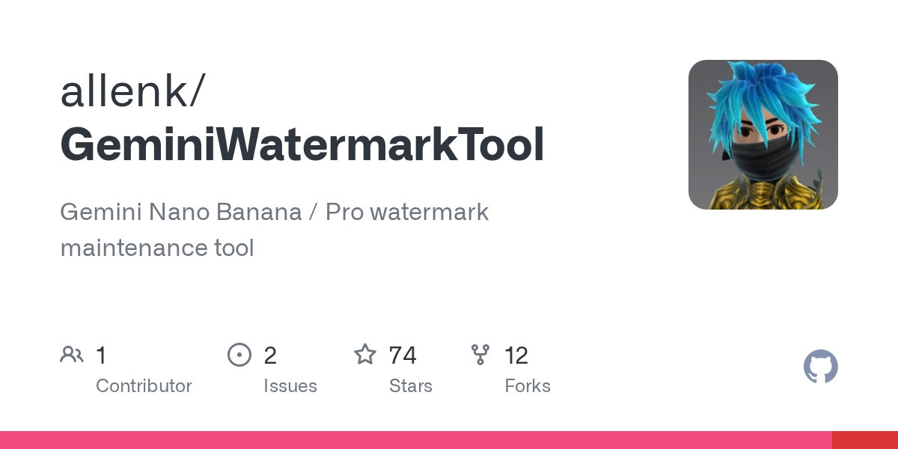

import Warning from "../../components/mdx/Warning.astro";



## 项目介绍

**GeminiWatermarkTool** 是一款开源命令行工具，可以离线去除 Google Gemini 生成图片右下角的可见水印。

项目地址：[allenk/GeminiWatermarkTool](https://github.com/allenk/GeminiWatermarkTool)

- **Stars:** 74
- **Forks:** 12
- **Contributors:** 1

## 核心特性

### 1. 离线处理

- 用 C++ 编写，无需依赖
- 完全本地运行，不依赖任何服务器
- 支持批量处理整个目录

### 2. 算法原理

采用**反向 Alpha 混合**计算来还原被水印覆盖的像素：

```
原始像素 = (混合像素 - 水印像素 × α) / (1 - α)
```

这个方法的优势在于：
- **精确性高** — 直接数学还原，不依赖 AI 修补
- **避免不确定性** — AI 修补可能引入额外的失真或错误
- **速度快** — 纯数学计算，处理速度很快

### 3. 格式支持

支持常见的图片格式：
- JPG
- PNG
- WebP

### 4. 批量处理

可以一次性处理整个目录的图片，适合大量去水印的场景。

## 使用方式

基本用法很简单：

```bash
# 处理单个文件
./gemini-watermark-remover input.png output.png

# 批量处理目录
./gemini-watermark-remover ./input_dir ./output_dir
```

## 前端版本

有开发者基于此项目开发了**纯前端版本**：

[journey-ad/gemini-watermark-remover](https://github.com/journey-ad/gemini-watermark-remover)

### 前端版本的优势

- **完全在浏览器本地运行** — 无需下载工具，打开网页即用
- **JavaScript 实现** — 跨平台兼容性更好
- **同样的算法** — 使用反向 Alpha 混合还原像素
- **隐私友好** — 所有处理都在本地，不上传到服务器

## 技术亮点

### 反向 Alpha 混合 vs AI 修补

| 方案 | 精确度 | 速度 | 依赖 | 稳定性 |
|------|--------|------|------|--------|
| 反向 Alpha 混合 | 高 | 快 | 无 | 高 |
| AI 修补 | 中 | 慢 | 模型 | 中 |

反向 Alpha 混合的核心优势是**确定性** — 同样的输入总是产生同样的输出，不会因为模型更新而变化。

## 局限性

作者坦诚了工具的局限：

- ✅ 支持去除**可见水印**（透明度混合的水印）
- ❌ 不支持去除**隐藏水印**（如 LSB 隐写、频域水印等）

这是合理的 — 可见水印是透明度混合，可以反向计算；隐藏水印需要更复杂的逆向工程。

## 适用场景

这个工具适合：

1. **Gemini 用户** — 想要保存无水印的生成图片
2. **批量处理** — 需要去除大量图片的水印
3. **隐私考虑** — 不想上传图片到在线工具
4. **开发者** — 想要集成到自己的工作流中

## 总结

GeminiWatermarkTool 是一个**简洁而有效**的开源项目：

- 算法原理清晰（反向 Alpha 混合）
- 实现方式多样（C++ CLI + JavaScript 前端）
- 使用场景明确（去除 Gemini 水印）
- 局限性透明（只支持可见水印）

无论你是想快速去除几张图片的水印，还是想理解 Alpha 混合的原理，这个项目都值得一看。

---

## 相关资源

- **C++ 版本：** https://github.com/allenk/GeminiWatermarkTool
- **前端版本：** https://github.com/journey-ad/gemini-watermark-remover
- **Alpha 混合原理：** 计算机图形学基础
